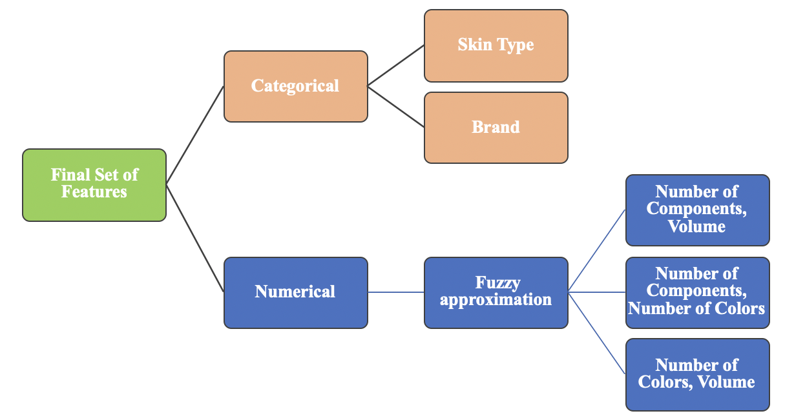

# Luxury Handbag Price Prediction

- Luxury handbags can cost anywhere between $2000 to $40000. This project was to understand the pricing of these luxury handbags and to predict them.
- Data collection was done by talking to experts from high end brands like Celine, Gucci, Tom Ford and Louis Vuitton around Rodeo Drive, Los Angeles.

## Feature Engineering
Based on experts opinion, out of the all the features collected, below are the features that are important in pricing luxury handbags.

- Brand - Chanel, Gucci, Celine, Hermes, Louis Vuitton, Tom ford
- Skin type - Crocodile, Alligator, Python, Snake, Lizard, Calf, Lamb
- Number of components in a bag - Single piece or different components stitched together
- Volume of the bag
- Production - Hand stitched or machine made bag

## Pre-processing
- Normalization of continuous features: Number of zips, Strap length, Number of compartments, Number of components, Number of  colors, Volume, Number of functionalities.
- Ordering Categorical features using Label Encoding - Metal type, Strap type, Inner material
- Ordering Categorical Features using One Hot Encoding - Brand, Accessories, Bag style, Major color, Skin Type

## Final Model - Ensemble Regression Model
Final model was a obtained by combining fuzzy approximations of numerical features along with the categorical features and build various regression models. For more details and results of other models like MLP, CNN, SVR, Random Forest Regressor etc., kindly looking into the [presentation.pdf](https://github.com/mcabinaya/Luxury-Handbag-Price-Prediction/blob/master/presentation.pdf) 

